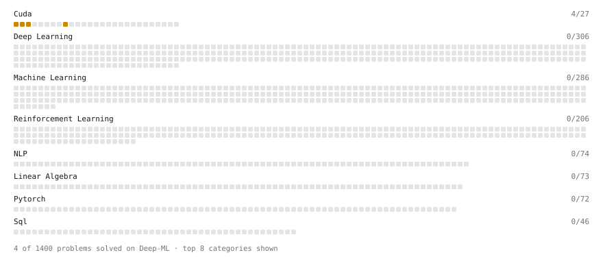

# Deep-ML

My machine learning practice from [Deep-ML](https://www.deep-ml.com). Every solution here was written by hand.

**317** solved · 290 problems · 13 labs · 14 math

[**Browse the interactive portfolio**](https://ngouanfouo.github.io/deep-ml/) to replay this filling in over time.

## Problems

| | Difficulty | Solved | |
| --- | --- | --- | --- |
| [Batch Iterator for Dataset](https://www.deep-ml.com/problems/30) | easy | 2026-07-03 | [solution](problems/0030-batch-iterator-for-dataset) |
| [Calculate 2x2 Matrix Inverse](https://www.deep-ml.com/problems/8) | easy | 2025-01-29 | [solution](problems/0008-calculate-2x2-matrix-inverse) |
| [Calculate Accuracy Score](https://www.deep-ml.com/problems/36) | easy | 2026-07-15 | [solution](problems/0036-calculate-accuracy-score) |
| [Calculate Cosine Similarity Between Vectors](https://www.deep-ml.com/problems/76) | easy | 2026-07-17 | [solution](problems/0076-calculate-cosine-similarity-between-vectors) |
| [Calculate Covariance Matrix](https://www.deep-ml.com/problems/10) | easy | 2025-01-13 | [solution](problems/0010-calculate-covariance-matrix) |
| [Calculate Dice Score for Classification](https://www.deep-ml.com/problems/73) | easy | 2026-07-17 | [solution](problems/0073-calculate-dice-score-for-classification) |
| [Calculate Image Brightness](https://www.deep-ml.com/problems/70) | easy | 2026-07-17 | [solution](problems/0070-calculate-image-brightness) |
| [Calculate Jaccard Index for Binary Classification](https://www.deep-ml.com/problems/72) | easy | 2026-07-17 | [solution](problems/0072-calculate-jaccard-index-for-binary-classification) |
| [Calculate Mean by Row or Column](https://www.deep-ml.com/problems/4) | easy | 2025-01-09 | [solution](problems/0004-calculate-mean-by-row-or-column) |
| [Calculate R-squared for Regression Analysis](https://www.deep-ml.com/problems/69) | easy | 2026-07-17 | [solution](problems/0069-calculate-r-squared-for-regression-analysis) |
| [Calculate Root Mean Square Error (RMSE)](https://www.deep-ml.com/problems/71) | easy | 2026-07-17 | [solution](problems/0071-calculate-root-mean-square-error-rmse) |
| [Check Linear Independence of Vectors](https://www.deep-ml.com/problems/331) | easy | 2026-09-17 | [solution](problems/0331-check-linear-independence-of-vectors) |
| [Compute a Gradient with PyTorch Autograd](https://www.deep-ml.com/problems/884) | easy | 2026-06-26 | [solution](problems/0884-compute-a-gradient-with-pytorch-autograd) |
| [Compute the Cross Product of Two 3D Vectors](https://www.deep-ml.com/problems/118) | easy | 2026-09-17 | [solution](problems/0118-compute-the-cross-product-of-two-3d-vectors) |
| [Convert Vector to Diagonal Matrix](https://www.deep-ml.com/problems/35) | easy | 2026-07-03 | [solution](problems/0035-convert-vector-to-diagonal-matrix) |
| [Descriptive Statistics Calculator](https://www.deep-ml.com/problems/78) | easy | 2026-07-17 | [solution](problems/0078-descriptive-statistics-calculator) |
| [Exponential Weighted Average of Rewards](https://www.deep-ml.com/problems/161) | easy | 2026-09-17 | [solution](problems/0161-exponential-weighted-average-of-rewards) |
| [Feature Scaling Implementation](https://www.deep-ml.com/problems/16) | easy | 2026-06-11 | [solution](problems/0016-feature-scaling-implementation) |
| [Forward Kinematics of a 2-Link Planar Arm](https://www.deep-ml.com/problems/1210) | easy | 2026-09-17 | [solution](problems/1210-forward-kinematics-of-a-2-link-planar-arm) |
| [Generate a Confusion Matrix for Binary Classification](https://www.deep-ml.com/problems/75) | easy | 2026-07-17 | [solution](problems/0075-generate-a-confusion-matrix-for-binary-classification) |
| [Grayscale Image Contrast Calculator](https://www.deep-ml.com/problems/82) | easy | 2026-07-17 | [solution](problems/0082-grayscale-image-contrast-calculator) |
| [Grid-Stride Loop: Square Each Element](https://www.deep-ml.com/problems/1205) | easy | 2026-09-17 | [solution](problems/1205-grid-stride-loop-square-each-element) |
| [Implement Compressed Column Sparse Matrix Format (CSC)](https://www.deep-ml.com/problems/67) | easy | 2026-07-17 | [solution](problems/0067-implement-compressed-column-sparse-matrix-format-csc) |
| [Implement Orthogonal Projection of a Vector onto a Line](https://www.deep-ml.com/problems/66) | easy | 2026-07-17 | [solution](problems/0066-implement-orthogonal-projection-of-a-vector-onto-a-line) |
| [Implement ReLU Activation Function](https://www.deep-ml.com/problems/42) | easy | 2025-01-09 | [solution](problems/0042-implement-relu-activation-function) |
| [Implement Ridge Regression Loss Function](https://www.deep-ml.com/problems/43) | easy | 2026-07-09 | [solution](problems/0043-implement-ridge-regression-loss-function) |
| [Implementation of Log Softmax Function](https://www.deep-ml.com/problems/39) | easy | 2026-07-15 | [solution](problems/0039-implementation-of-log-softmax-function) |
| [Incremental Mean for Online Reward Estimation](https://www.deep-ml.com/problems/159) | easy | 2026-09-17 | [solution](problems/0159-incremental-mean-for-online-reward-estimation) |
| [Linear Regression Using Gradient Descent](https://www.deep-ml.com/problems/15) | easy | 2025-01-13 | [solution](problems/0015-linear-regression-using-gradient-descent) |
| [Linear Regression Using Normal Equation](https://www.deep-ml.com/problems/14) | easy | 2025-01-09 | [solution](problems/0014-linear-regression-using-normal-equation) |
| [Matrix-Vector Dot Product](https://www.deep-ml.com/problems/1) | easy | 2025-01-08 | [solution](problems/0001-matrix-vector-dot-product) |
| [One-Hot Encoding of Nominal Values](https://www.deep-ml.com/problems/34) | easy | 2026-07-03 | [solution](problems/0034-one-hot-encoding-of-nominal-values) |
| [Poisson Distribution Probability Calculator](https://www.deep-ml.com/problems/81) | easy | 2026-07-17 | [solution](problems/0081-poisson-distribution-probability-calculator) |
| [Quality Filtering with Rejection Sampling](https://www.deep-ml.com/problems/508) | easy | 2026-06-12 | [solution](problems/0508-quality-filtering-with-rejection-sampling) |
| [Random Shuffle of Dataset](https://www.deep-ml.com/problems/29) | easy | 2026-06-30 | [solution](problems/0029-random-shuffle-of-dataset) |
| [ReLU Activation](https://www.deep-ml.com/problems/1204) | easy | 2026-09-17 | [solution](problems/1204-relu-activation) |
| [Reshape Matrix](https://www.deep-ml.com/problems/3) | easy | 2025-01-09 | [solution](problems/0003-reshape-matrix) |
| [Scalar Multiplication of a Matrix](https://www.deep-ml.com/problems/5) | easy | 2025-01-08 | [solution](problems/0005-scalar-multiplication-of-a-matrix) |
| [Scalar Multiply (a * x)](https://www.deep-ml.com/problems/1203) | easy | 2026-09-17 | [solution](problems/1203-scalar-multiply-a-x) |
| [Sigmoid Activation Function Understanding](https://www.deep-ml.com/problems/22) | easy | 2026-06-30 | [solution](problems/0022-sigmoid-activation-function-understanding) |
| [Single Neuron](https://www.deep-ml.com/problems/24) | easy | 2026-07-03 | [solution](problems/0024-single-neuron) |
| [Softmax Activation Function Implementation ](https://www.deep-ml.com/problems/23) | easy | 2026-07-03 | [solution](problems/0023-softmax-activation-function-implementation) |
| [Transformation Matrix from Basis B to C](https://www.deep-ml.com/problems/27) | easy | 2026-06-30 | [solution](problems/0027-transformation-matrix-from-basis-b-to-c) |
| [Transpose of a Matrix](https://www.deep-ml.com/problems/2) | easy | 2025-01-08 | [solution](problems/0002-transpose-of-a-matrix) |
| [Upper Confidence Bound (UCB) Action Selection](https://www.deep-ml.com/problems/162) | easy | 2026-09-17 | [solution](problems/0162-upper-confidence-bound-ucb-action-selection) |
| [Vector Addition](https://www.deep-ml.com/problems/1202) | easy | 2026-09-17 | [solution](problems/1202-vector-addition) |
| [Vector Element-wise Sum](https://www.deep-ml.com/problems/121) | easy | 2026-09-17 | [solution](problems/0121-vector-element-wise-sum) |
| [Vector Norms (L1/L2/L-inf) and the Frobenius Norm](https://www.deep-ml.com/problems/328) | easy | 2026-08-04 | [solution](problems/0328-vector-norms-l1-l2-l-inf-and-the-frobenius-norm) |
| [Your First CUDA Kernel: Thread Index](https://www.deep-ml.com/problems/1201) | easy | 2026-09-17 | [solution](problems/1201-your-first-cuda-kernel-thread-index) |
| [1D Convolution with Shared-Memory Halo](https://www.deep-ml.com/problems/1310) | medium | 2026-09-17 | [solution](problems/1310-1d-convolution-with-shared-memory-halo) |
| [1D Kalman Filter Predict-Update Step](https://www.deep-ml.com/problems/1213) | medium | 2026-09-17 | [solution](problems/1213-1d-kalman-filter-predict-update-step) |
| [2D Translation Matrix Implementation](https://www.deep-ml.com/problems/55) | medium | 2026-06-30 | [solution](problems/0055-2d-translation-matrix-implementation) |
| [Adadelta Optimizer](https://www.deep-ml.com/problems/149) | medium | 2026-07-15 | [solution](problems/0149-adadelta-optimizer) |
| [Adam Optimizer](https://www.deep-ml.com/problems/87) | medium | 2026-07-04 | [solution](problems/0087-adam-optimizer) |
| [Add Two Matrices (2D Grid)](https://www.deep-ml.com/problems/1206) | medium | 2026-09-15 | [solution](problems/1206-add-two-matrices-2d-grid) |
| [Analyze Canary Deployment Health for Model Rollout](https://www.deep-ml.com/problems/251) | medium | 2026-08-04 | [solution](problems/0251-analyze-canary-deployment-health-for-model-rollout) |
| [Apriori Frequent Itemset Mining](https://www.deep-ml.com/problems/144) | medium | 2026-07-15 | [solution](problems/0144-apriori-frequent-itemset-mining) |
| [Bayesian Inference for Beta-Binomial Model](https://www.deep-ml.com/problems/213) | medium | 2026-07-29 | [solution](problems/0213-bayesian-inference-for-beta-binomial-model) |
| [Bernoulli Naive Bayes Classifier](https://www.deep-ml.com/problems/140) | medium | 2026-07-09 | [solution](problems/0140-bernoulli-naive-bayes-classifier) |
| [Bilinear Image Resizing](https://www.deep-ml.com/problems/240) | medium | 2026-08-04 | [solution](problems/0240-bilinear-image-resizing) |
| [Binomial Distribution Probability](https://www.deep-ml.com/problems/79) | medium | 2026-07-03 | [solution](problems/0079-binomial-distribution-probability) |
| [Birthday Problem Probability](https://www.deep-ml.com/problems/246) | medium | 2026-08-04 | [solution](problems/0246-birthday-problem-probability) |
| [Block-wise FP8 Quantization](https://www.deep-ml.com/problems/234) | medium | 2026-08-04 | [solution](problems/0234-block-wise-fp8-quantization) |
| [BM25 Ranking ](https://www.deep-ml.com/problems/90) | medium | 2026-07-04 | [solution](problems/0090-bm25-ranking) |
| [Budget-Constrained RL Loss](https://www.deep-ml.com/problems/228) | medium | 2026-07-29 | [solution](problems/0228-budget-constrained-rl-loss) |
| [Build a Simple ETL Pipeline (MLOps)](https://www.deep-ml.com/problems/187) | medium | 2026-07-20 | [solution](problems/0187-build-a-simple-etl-pipeline-mlops) |
| [Calculate Correlation Matrix](https://www.deep-ml.com/problems/37) | medium | 2026-06-12 | [solution](problems/0037-calculate-correlation-matrix) |
| [Calculate Eigenvalues of a Matrix](https://www.deep-ml.com/problems/6) | medium | 2025-01-09 | [solution](problems/0006-calculate-eigenvalues-of-a-matrix) |
| [Calculate KL Divergence Between Two Multivariate Gaussian Distributions](https://www.deep-ml.com/problems/136) | medium | 2026-07-07 | [solution](problems/0136-calculate-kl-divergence-between-two-multivariate-gaussian-distributions) |
| [Calculate Performance Metrics for a Classification Model](https://www.deep-ml.com/problems/77) | medium | 2026-07-03 | [solution](problems/0077-calculate-performance-metrics-for-a-classification-model) |
| [Cart-Pole Balancing with Linear Policy Simulation](https://www.deep-ml.com/problems/575) | medium | 2026-07-29 | [solution](problems/0575-cart-pole-balancing-with-linear-policy-simulation) |
| [Central Limit Theorem Simulation](https://www.deep-ml.com/problems/182) | medium | 2026-07-20 | [solution](problems/0182-central-limit-theorem-simulation) |
| [Chain Rule for Composite Functions](https://www.deep-ml.com/problems/214) | medium | 2026-07-29 | [solution](problems/0214-chain-rule-for-composite-functions) |
| [Chi-square Probability Distribution](https://www.deep-ml.com/problems/176) | medium | 2026-07-17 | [solution](problems/0176-chi-square-probability-distribution) |
| [Coalesced Matrix Transpose](https://www.deep-ml.com/problems/1309) | medium | 2026-09-17 | [solution](problems/1309-coalesced-matrix-transpose) |
| [Compute Confusion Matrix with Normalization](https://www.deep-ml.com/problems/193) | medium | 2026-07-20 | [solution](problems/0193-compute-confusion-matrix-with-normalization) |
| [Compute Covariance from Joint Probability Mass Function](https://www.deep-ml.com/problems/243) | medium | 2026-08-04 | [solution](problems/0243-compute-covariance-from-joint-probability-mass-function) |
| [Compute Normalized Subspace Similarity Between Low-Rank Matrices](https://www.deep-ml.com/problems/868) | medium | 2026-09-17 | [solution](problems/0868-compute-normalized-subspace-similarity-between-low-rank-matrices) |
| [Compute Orthonormal Basis for 2D Vectors](https://www.deep-ml.com/problems/117) | medium | 2026-07-06 | [solution](problems/0117-compute-orthonormal-basis-for-2d-vectors) |
| [Compute Pointwise Mutual Information](https://www.deep-ml.com/problems/111) | medium | 2026-07-06 | [solution](problems/0111-compute-pointwise-mutual-information) |
| [Compute the Hessian Matrix](https://www.deep-ml.com/problems/218) | medium | 2026-07-29 | [solution](problems/0218-compute-the-hessian-matrix) |
| [Compute Total Probability using Law of Total Probability](https://www.deep-ml.com/problems/244) | medium | 2026-08-04 | [solution](problems/0244-compute-total-probability-using-law-of-total-probability) |
| [Conditional Probability from Joint Distribution](https://www.deep-ml.com/problems/180) | medium | 2026-07-20 | [solution](problems/0180-conditional-probability-from-joint-distribution) |
| [Confidence Interval for Population Mean](https://www.deep-ml.com/problems/212) | medium | 2026-07-29 | [solution](problems/0212-confidence-interval-for-population-mean) |
| [CosineAnnealingLR Learning Rate Scheduler](https://www.deep-ml.com/problems/155) | medium | 2026-07-15 | [solution](problems/0155-cosineannealinglr-learning-rate-scheduler) |
| [Create Composite Hypervector for a Dataset Row](https://www.deep-ml.com/problems/74) | medium | 2026-06-30 | [solution](problems/0074-create-composite-hypervector-for-a-dataset-row) |
| [Data Quality Scoring for ML Pipelines](https://www.deep-ml.com/problems/252) | medium | 2026-08-04 | [solution](problems/0252-data-quality-scoring-for-ml-pipelines) |
| [Derivative of Cross-Entropy Loss w.r.t. Logits](https://www.deep-ml.com/problems/220) | medium | 2026-07-29 | [solution](problems/0220-derivative-of-cross-entropy-loss-w-r-t-logits) |
| [Derivative of Softmax](https://www.deep-ml.com/problems/219) | medium | 2026-07-29 | [solution](problems/0219-derivative-of-softmax) |
| [Divide Dataset Based on Feature Threshold](https://www.deep-ml.com/problems/31) | medium | 2026-06-12 | [solution](problems/0031-divide-dataset-based-on-feature-threshold) |
| [Dot Product](https://www.deep-ml.com/problems/1208) | medium | 2026-09-17 | [solution](problems/1208-dot-product) |
| [Dr. GRPO: Complete Objective Function](https://www.deep-ml.com/problems/210) | medium | 2026-07-29 | [solution](problems/0210-dr-grpo-complete-objective-function) |
| [Dropout Layer](https://www.deep-ml.com/problems/151) | medium | 2026-07-15 | [solution](problems/0151-dropout-layer) |
| [Entropy & Cross-Entropy](https://www.deep-ml.com/problems/205) | medium | 2026-07-29 | [solution](problems/0205-entropy-cross-entropy) |
| [Epsilon-Greedy Action Selection for n-Armed Bandit](https://www.deep-ml.com/problems/158) | medium | 2026-07-17 | [solution](problems/0158-epsilon-greedy-action-selection-for-n-armed-bandit) |
| [Evaluate Expected Value in a Markov Decision Process](https://www.deep-ml.com/problems/166) | medium | 2026-07-17 | [solution](problems/0166-evaluate-expected-value-in-a-markov-decision-process) |
| [Evaluate Translation Quality with METEOR Score](https://www.deep-ml.com/problems/110) | medium | 2026-07-06 | [solution](problems/0110-evaluate-translation-quality-with-meteor-score) |
| [Feature Drift Detection using Population Stability Index](https://www.deep-ml.com/problems/253) | medium | 2026-08-04 | [solution](problems/0253-feature-drift-detection-using-population-stability-index) |
| [Find Captain Redbeard's Hidden Treasure](https://www.deep-ml.com/problems/127) | medium | 2026-06-19 | [solution](problems/0127-find-captain-redbeard-s-hidden-treasure) |
| [Find the Best Gini-Based Split for a Binary Decision Tree](https://www.deep-ml.com/problems/138) | medium | 2026-07-07 | [solution](problems/0138-find-the-best-gini-based-split-for-a-binary-decision-tree) |
| [Find the column space of a matrix](https://www.deep-ml.com/problems/68) | medium | 2026-07-03 | [solution](problems/0068-find-the-column-space-of-a-matrix) |
| [Fused Bias+ReLU CUDA Kernel](https://www.deep-ml.com/problems/1188) | medium | 2026-09-15 | [solution](problems/1188-fused-bias-relu-cuda-kernel) |
| [Fused Row-wise Softmax CUDA Kernel](https://www.deep-ml.com/problems/1252) | medium | 2026-09-17 | [solution](problems/1252-fused-row-wise-softmax-cuda-kernel) |
| [Gauss-Seidel Method for Solving Linear Systems](https://www.deep-ml.com/problems/57) | medium | 2026-07-03 | [solution](problems/0057-gauss-seidel-method-for-solving-linear-systems) |
| [Gaussian Elimination for Solving Linear Systems](https://www.deep-ml.com/problems/58) | medium | 2026-07-03 | [solution](problems/0058-gaussian-elimination-for-solving-linear-systems) |
| [Generate Random Subsets of a Dataset](https://www.deep-ml.com/problems/33) | medium | 2026-06-14 | [solution](problems/0033-generate-random-subsets-of-a-dataset) |
| [Generate Sorted Polynomial Features](https://www.deep-ml.com/problems/32) | medium | 2026-06-14 | [solution](problems/0032-generate-sorted-polynomial-features) |
| [Gradient Bandit Action Selection](https://www.deep-ml.com/problems/163) | medium | 2026-07-17 | [solution](problems/0163-gradient-bandit-action-selection) |
| [Gradient Clipping by Global Norm](https://www.deep-ml.com/problems/197) | medium | 2026-07-20 | [solution](problems/0197-gradient-clipping-by-global-norm) |
| [Gridworld Policy Evaluation](https://www.deep-ml.com/problems/142) | medium | 2026-07-09 | [solution](problems/0142-gridworld-policy-evaluation) |
| [Hypergeometric Distribution PMF](https://www.deep-ml.com/problems/245) | medium | 2026-08-04 | [solution](problems/0245-hypergeometric-distribution-pmf) |
| [Implement Adam Optimization Algorithm](https://www.deep-ml.com/problems/49) | medium | 2026-06-26 | [solution](problems/0049-implement-adam-optimization-algorithm) |
| [Implement AdamW Optimizer Step](https://www.deep-ml.com/problems/169) | medium | 2026-07-17 | [solution](problems/0169-implement-adamw-optimizer-step) |
| [Implement Batch Normalization for BCHW Input](https://www.deep-ml.com/problems/115) | medium | 2026-07-06 | [solution](problems/0115-implement-batch-normalization-for-bchw-input) |
| [Implement Efficient Sparse Window Attention](https://www.deep-ml.com/problems/131) | medium | 2026-07-07 | [solution](problems/0131-implement-efficient-sparse-window-attention) |
| [Implement Gated Attention](https://www.deep-ml.com/problems/271) | medium | 2026-06-14 | [solution](problems/0271-implement-gated-attention) |
| [Implement Gradient Descent Variants with MSE Loss](https://www.deep-ml.com/problems/47) | medium | 2026-06-14 | [solution](problems/0047-implement-gradient-descent-variants-with-mse-loss) |
| [Implement Group Normalization](https://www.deep-ml.com/problems/126) | medium | 2026-07-07 | [solution](problems/0126-implement-group-normalization) |
| [Implement K-Fold Cross-Validation](https://www.deep-ml.com/problems/18) | medium | 2026-06-11 | [solution](problems/0018-implement-k-fold-cross-validation) |
| [Implement K-Nearest Neighbors](https://www.deep-ml.com/problems/173) | medium | 2026-07-17 | [solution](problems/0173-implement-k-nearest-neighbors) |
| [Implement Label Smoothing for Multi-Class Cross-Entropy](https://www.deep-ml.com/problems/194) | medium | 2026-07-20 | [solution](problems/0194-implement-label-smoothing-for-multi-class-cross-entropy) |
| [Implement Lasso Regression using ISTA](https://www.deep-ml.com/problems/50) | medium | 2026-06-30 | [solution](problems/0050-implement-lasso-regression-using-ista) |
| [Implement Layer Normalization for Sequence Data](https://www.deep-ml.com/problems/109) | medium | 2026-07-06 | [solution](problems/0109-implement-layer-normalization-for-sequence-data) |
| [Implement Local Response Normalization (LRN)](https://www.deep-ml.com/problems/189) | medium | 2026-07-20 | [solution](problems/0189-implement-local-response-normalization-lrn) |
| [Implement Long Short-Term Memory (LSTM) Network](https://www.deep-ml.com/problems/59) | medium | 2026-06-30 | [solution](problems/0059-implement-long-short-term-memory-lstm-network) |
| [Implement Masked Self-Attention](https://www.deep-ml.com/problems/107) | medium | 2026-07-06 | [solution](problems/0107-implement-masked-self-attention) |
| [Implement MuonClip (qk-clip) for Stabilizing Attention](https://www.deep-ml.com/problems/177) | medium | 2026-07-17 | [solution](problems/0177-implement-muonclip-qk-clip-for-stabilizing-attention) |
| [Implement Position-wise Feed-Forward Block with Residual and Dropout](https://www.deep-ml.com/problems/178) | medium | 2026-07-20 | [solution](problems/0178-implement-position-wise-feed-forward-block-with-residual-and-dropout) |
| [Implement PReLU Forward and Backward Pass](https://www.deep-ml.com/problems/98) | medium | 2026-07-06 | [solution](problems/0098-implement-prelu-forward-and-backward-pass) |
| [Implement Q-Learning Algorithm for MDPs](https://www.deep-ml.com/problems/133) | medium | 2026-07-07 | [solution](problems/0133-implement-q-learning-algorithm-for-mdps) |
| [Implement Reduced Row Echelon Form (RREF) Function](https://www.deep-ml.com/problems/48) | medium | 2026-06-19 | [solution](problems/0048-implement-reduced-row-echelon-form-rref-function) |
| [Implement RMSProp Optimizer](https://www.deep-ml.com/problems/200) | medium | 2026-07-20 | [solution](problems/0200-implement-rmsprop-optimizer) |
| [Implement Self-Attention Mechanism](https://www.deep-ml.com/problems/53) | medium | 2026-06-30 | [solution](problems/0053-implement-self-attention-mechanism) |
| [Implement TF-IDF (Term Frequency-Inverse Document Frequency)](https://www.deep-ml.com/problems/60) | medium | 2026-07-03 | [solution](problems/0060-implement-tf-idf-term-frequency-inverse-document-frequency) |
| [Implement the Bellman Equation for Value Iteration](https://www.deep-ml.com/problems/157) | medium | 2026-07-17 | [solution](problems/0157-implement-the-bellman-equation-for-value-iteration) |
| [Implement the Huber Loss Function](https://www.deep-ml.com/problems/192) | medium | 2026-07-20 | [solution](problems/0192-implement-the-huber-loss-function) |
| [Implement the Noisy Top-K Gating Function](https://www.deep-ml.com/problems/124) | medium | 2026-07-07 | [solution](problems/0124-implement-the-noisy-top-k-gating-function) |
| [Implement the SARSA Algorithm on policy](https://www.deep-ml.com/problems/175) | medium | 2026-07-17 | [solution](problems/0175-implement-the-sarsa-algorithm-on-policy) |
| [Implement the SGTM Parameter Update Step](https://www.deep-ml.com/problems/235) | medium | 2026-08-04 | [solution](problems/0235-implement-the-sgtm-parameter-update-step) |
| [Implementing a Simple RNN](https://www.deep-ml.com/problems/54) | medium | 2026-06-30 | [solution](problems/0054-implementing-a-simple-rnn) |
| [Implementing Basic Autograd Operations](https://www.deep-ml.com/problems/26) | medium | 2026-06-12 | [solution](problems/0026-implementing-basic-autograd-operations) |
| [Implementing ROUGE Score](https://www.deep-ml.com/problems/152) | medium | 2026-07-15 | [solution](problems/0152-implementing-rouge-score) |
| [Inference Head Pruning for Transformers](https://www.deep-ml.com/problems/233) | medium | 2026-08-04 | [solution](problems/0233-inference-head-pruning-for-transformers) |
| [Instance Normalization (IN) Implementation](https://www.deep-ml.com/problems/143) | medium | 2026-07-15 | [solution](problems/0143-instance-normalization-in-implementation) |
| [Inverse Kinematics of a 2-Link Planar Arm](https://www.deep-ml.com/problems/1211) | medium | 2026-09-17 | [solution](problems/1211-inverse-kinematics-of-a-2-link-planar-arm) |
| [Jacobian Matrix Calculation](https://www.deep-ml.com/problems/202) | medium | 2026-07-20 | [solution](problems/0202-jacobian-matrix-calculation) |
| [Jensen-Shannon Divergence](https://www.deep-ml.com/problems/203) | medium | 2026-07-20 | [solution](problems/0203-jensen-shannon-divergence) |
| [K-Means Clustering](https://www.deep-ml.com/problems/17) | medium | 2026-06-11 | [solution](problems/0017-k-means-clustering) |
| [Knowledge Distillation Loss](https://www.deep-ml.com/problems/227) | medium | 2026-07-29 | [solution](problems/0227-knowledge-distillation-loss) |
| [Linear Regression - Power Grid Optimization](https://www.deep-ml.com/problems/92) | medium | 2026-07-04 | [solution](problems/0092-linear-regression-power-grid-optimization) |
| [LoRA: Low-Rank Adaptation Forward Pass](https://www.deep-ml.com/problems/222) | medium | 2026-07-29 | [solution](problems/0222-lora-low-rank-adaptation-forward-pass) |
| [Matrix times Matrix ](https://www.deep-ml.com/problems/9) | medium | 2025-01-29 | [solution](problems/0009-matrix-times-matrix) |
| [Matrix Transformation ](https://www.deep-ml.com/problems/7) | medium | 2025-01-29 | [solution](problems/0007-matrix-transformation) |
| [Mean Ablation for Circuit Discovery](https://www.deep-ml.com/problems/236) | medium | 2026-08-04 | [solution](problems/0236-mean-ablation-for-circuit-discovery) |
| [Minimax Algorithm for Tic-Tac-Toe](https://www.deep-ml.com/problems/171) | medium | 2026-07-17 | [solution](problems/0171-minimax-algorithm-for-tic-tac-toe) |
| [Mixed Precision Training](https://www.deep-ml.com/problems/160) | medium | 2026-07-17 | [solution](problems/0160-mixed-precision-training) |
| [Muon Optimizer Step with Matrix Preconditioning](https://www.deep-ml.com/problems/170) | medium | 2026-07-17 | [solution](problems/0170-muon-optimizer-step-with-matrix-preconditioning) |
| [Muon Optimizer Update with Newton-Schulz Iteration](https://www.deep-ml.com/problems/172) | medium | 2026-07-17 | [solution](problems/0172-muon-optimizer-update-with-newton-schulz-iteration) |
| [Mutual Information](https://www.deep-ml.com/problems/204) | medium | 2026-07-29 | [solution](problems/0204-mutual-information) |
| [Naive Matrix Multiplication](https://www.deep-ml.com/problems/1209) | medium | 2026-09-17 | [solution](problems/1209-naive-matrix-multiplication) |
| [Negative Binomial Distribution Probability](https://www.deep-ml.com/problems/247) | medium | 2026-08-04 | [solution](problems/0247-negative-binomial-distribution-probability) |
| [Newton-Schulz Iteration for Approximate Orthogonalization](https://www.deep-ml.com/problems/739) | medium | 2026-09-17 | [solution](problems/0739-newton-schulz-iteration-for-approximate-orthogonalization) |
| [Newton's Method for Optimization](https://www.deep-ml.com/problems/221) | medium | 2026-07-29 | [solution](problems/0221-newton-s-method-for-optimization) |
| [Normal Distribution PDF Calculator](https://www.deep-ml.com/problems/80) | medium | 2026-06-19 | [solution](problems/0080-normal-distribution-pdf-calculator) |
| [Optical Flow EPE with Masks (OmniWorld-style metric)](https://www.deep-ml.com/problems/185) | medium | 2026-07-20 | [solution](problems/0185-optical-flow-epe-with-masks-omniworld-style-metric) |
| [Optimal String Alignment Distance](https://www.deep-ml.com/problems/51) | medium | 2026-06-30 | [solution](problems/0051-optimal-string-alignment-distance) |
| [Overlapping Max Pooling](https://www.deep-ml.com/problems/190) | medium | 2026-07-20 | [solution](problems/0190-overlapping-max-pooling) |
| [Parallel Reduction (Block Sum) CUDA Kernel](https://www.deep-ml.com/problems/1189) | medium | 2026-09-15 | [solution](problems/1189-parallel-reduction-block-sum-cuda-kernel) |
| [Parallel Reduction: Array Sum](https://www.deep-ml.com/problems/1207) | medium | 2026-09-15 | [solution](problems/1207-parallel-reduction-array-sum) |
| [Partial Derivatives of Multivariable Functions](https://www.deep-ml.com/problems/215) | medium | 2026-07-29 | [solution](problems/0215-partial-derivatives-of-multivariable-functions) |
| [Principal Component Analysis (PCA) Implementation](https://www.deep-ml.com/problems/19) | medium | 2026-06-11 | [solution](problems/0019-principal-component-analysis-pca-implementation) |
| [Prioritized Experience Replay](https://www.deep-ml.com/problems/591) | medium | 2026-06-19 | [solution](problems/0591-prioritized-experience-replay) |
| [PTX Loss for Catastrophic Forgetting Prevention (RLHF)](https://www.deep-ml.com/problems/232) | medium | 2026-08-04 | [solution](problems/0232-ptx-loss-for-catastrophic-forgetting-prevention-rlhf) |
| [QLoRA: Quantized Low-Rank Adaptation Forward Pass](https://www.deep-ml.com/problems/223) | medium | 2026-07-29 | [solution](problems/0223-qlora-quantized-low-rank-adaptation-forward-pass) |
| [Quaternion SLERP Interpolation](https://www.deep-ml.com/problems/1212) | medium | 2026-09-17 | [solution](problems/1212-quaternion-slerp-interpolation) |
| [Simple Convolutional 2D Layer](https://www.deep-ml.com/problems/41) | medium | 2026-06-12 | [solution](problems/0041-simple-convolutional-2d-layer) |
| [Simulate Markov Chain Transitions](https://www.deep-ml.com/problems/132) | medium | 2026-07-07 | [solution](problems/0132-simulate-markov-chain-transitions) |
| [Single Neuron with Backpropagation](https://www.deep-ml.com/problems/25) | medium | 2026-06-11 | [solution](problems/0025-single-neuron-with-backpropagation) |
| [Sinkhorn-Knopp Doubly Stochastic Projection](https://www.deep-ml.com/problems/732) | medium | 2026-09-17 | [solution](problems/0732-sinkhorn-knopp-doubly-stochastic-projection) |
| [Sobel Edge Detection](https://www.deep-ml.com/problems/241) | medium | 2026-08-04 | [solution](problems/0241-sobel-edge-detection) |
| [Solve Linear Equations using Jacobi Method](https://www.deep-ml.com/problems/11) | medium | 2025-01-29 | [solution](problems/0011-solve-linear-equations-using-jacobi-method) |
| [Solve System of Linear Equations Using Cramer's Rule](https://www.deep-ml.com/problems/119) | medium | 2026-07-07 | [solution](problems/0119-solve-system-of-linear-equations-using-cramer-s-rule) |
| [Sparse MoE Top-K Routing](https://www.deep-ml.com/problems/229) | medium | 2026-07-29 | [solution](problems/0229-sparse-moe-top-k-routing) |
| [Subspace Amplification of Pretrained Weights by a Low-Rank Update](https://www.deep-ml.com/problems/869) | medium | 2026-09-17 | [solution](problems/0869-subspace-amplification-of-pretrained-weights-by-a-low-rank-update) |
| [Temperature Decay Scheduler](https://www.deep-ml.com/problems/231) | medium | 2026-07-29 | [solution](problems/0231-temperature-decay-scheduler) |
| [The Pattern Weaver's Code](https://www.deep-ml.com/problems/89) | medium | 2026-07-04 | [solution](problems/0089-the-pattern-weaver-s-code) |
| [Tiled Matrix Multiply CUDA Kernel](https://www.deep-ml.com/problems/1187) | medium | 2026-09-15 | [solution](problems/1187-tiled-matrix-multiply-cuda-kernel) |
| [Top-3 Salaries Per Department](https://www.deep-ml.com/problems/1111) | medium | 2026-07-09 | [solution](problems/1111-top-3-salaries-per-department) |
| [Warmup + Cosine Decay Schedule](https://www.deep-ml.com/problems/196) | medium | 2026-07-20 | [solution](problems/0196-warmup-cosine-decay-schedule) |
| [3D CNN Forward Pass Implementation](https://www.deep-ml.com/problems/230) | hard | 2026-07-03 | [solution](problems/0230-3d-cnn-forward-pass-implementation) |
| [A/B Test Statistical Analysis for Model Comparison](https://www.deep-ml.com/problems/269) | hard | 2026-07-03 | [solution](problems/0269-a-b-test-statistical-analysis-for-model-comparison) |
| [Actor-Critic Algorithm](https://www.deep-ml.com/problems/538) | hard | 2026-07-23 | [solution](problems/0538-actor-critic-algorithm) |
| [Actor-Critic with Traces](https://www.deep-ml.com/problems/539) | hard | 2026-07-23 | [solution](problems/0539-actor-critic-with-traces) |
| [Advantage Actor-Critic (A2C) Batch Update from Parallel Environments](https://www.deep-ml.com/problems/553) | hard | 2026-07-23 | [solution](problems/0553-advantage-actor-critic-a2c-batch-update-from-parallel-environments) |
| [Asynchronous Advantage Actor-Critic (A3C)](https://www.deep-ml.com/problems/594) | hard | 2026-08-02 | [solution](problems/0594-asynchronous-advantage-actor-critic-a3c) |
| [Asynchronous PPO Training Pipeline](https://www.deep-ml.com/problems/664) | hard | 2026-08-04 | [solution](problems/0664-asynchronous-ppo-training-pipeline) |
| [Backgammon with TD Learning](https://www.deep-ml.com/problems/579) | hard | 2026-08-02 | [solution](problems/0579-backgammon-with-td-learning) |
| [Beam Search with Memory-Efficient Block Sharing](https://www.deep-ml.com/problems/496) | hard | 2026-07-20 | [solution](problems/0496-beam-search-with-memory-efficient-block-sharing) |
| [Build a Transformer Encoder Layer](https://www.deep-ml.com/problems/491) | hard | 2026-07-20 | [solution](problems/0491-build-a-transformer-encoder-layer) |
| [Certainty-Equivalence in TD Learning](https://www.deep-ml.com/problems/516) | hard | 2026-07-20 | [solution](problems/0516-certainty-equivalence-in-td-learning) |
| [Combined Token Sampling Pipeline (Temperature + Top-k + Top-p)](https://www.deep-ml.com/problems/419) | hard | 2026-07-09 | [solution](problems/0419-combined-token-sampling-pipeline-temperature-top-k-top-p) |
| [Context Parallelism with Ring Attention for Video Models](https://www.deep-ml.com/problems/448) | hard | 2026-07-15 | [solution](problems/0448-context-parallelism-with-ring-attention-for-video-models) |
| [Control Variates in Off-Policy Methods](https://www.deep-ml.com/problems/584) | hard | 2026-08-02 | [solution](problems/0584-control-variates-in-off-policy-methods) |
| [Decision Tree Learning](https://www.deep-ml.com/problems/20) | hard | 2026-06-11 | [solution](problems/0020-decision-tree-learning) |
| [Deep Q-Network Implementation](https://www.deep-ml.com/problems/551) | hard | 2026-07-23 | [solution](problems/0551-deep-q-network-implementation) |
| [Designing 4D Parallelism for Large Model Training](https://www.deep-ml.com/problems/506) | hard | 2026-07-20 | [solution](problems/0506-designing-4d-parallelism-for-large-model-training) |
| [Determinant of a 4x4 Matrix using Laplace's Expansion (hard)](https://www.deep-ml.com/problems/13) | hard | 2025-05-25 | [solution](problems/0013-determinant-of-a-4x4-matrix-using-laplace-s-expansion-hard) |
| [Deterministic Policy Gradient](https://www.deep-ml.com/problems/589) | hard | 2026-08-02 | [solution](problems/0589-deterministic-policy-gradient) |
| [Differential Sarsa Algorithm](https://www.deep-ml.com/problems/541) | hard | 2026-07-23 | [solution](problems/0541-differential-sarsa-algorithm) |
| [Disaggregated Prefill-Decode Serving Simulator](https://www.deep-ml.com/problems/440) | hard | 2026-07-15 | [solution](problems/0440-disaggregated-prefill-decode-serving-simulator) |
| [Distributed On-Policy Reinforcement Learning](https://www.deep-ml.com/problems/504) | hard | 2026-07-20 | [solution](problems/0504-distributed-on-policy-reinforcement-learning) |
| [Dyna-Q: Model-Based RL with Planning](https://www.deep-ml.com/problems/524) | hard | 2026-07-20 | [solution](problems/0524-dyna-q-model-based-rl-with-planning) |
| [Emphatic Temporal Difference Learning for Off-Policy Evaluation](https://www.deep-ml.com/problems/568) | hard | 2026-07-29 | [solution](problems/0568-emphatic-temporal-difference-learning-for-off-policy-evaluation) |
| [EnvPool-style Asynchronous Environment Pooling](https://www.deep-ml.com/problems/656) | hard | 2026-08-04 | [solution](problems/0656-envpool-style-asynchronous-environment-pooling) |
| [First-Visit Monte Carlo Control with Exploring Starts](https://www.deep-ml.com/problems/470) | hard | 2026-07-15 | [solution](problems/0470-first-visit-monte-carlo-control-with-exploring-starts) |
| [FP4 Quantization with Microscaling (MXFP4)](https://www.deep-ml.com/problems/427) | hard | 2026-06-30 | [solution](problems/0427-fp4-quantization-with-microscaling-mxfp4) |
| [Gambler's Problem: Value Iteration](https://www.deep-ml.com/problems/164) | hard | 2026-06-30 | [solution](problems/0164-gambler-s-problem-value-iteration) |
| [Gaussian Process for Regression](https://www.deep-ml.com/problems/186) | hard | 2026-06-30 | [solution](problems/0186-gaussian-process-for-regression) |
| [Goal-Conditioned World Model with Future Anchoring](https://www.deep-ml.com/problems/683) | hard | 2026-08-04 | [solution](problems/0683-goal-conditioned-world-model-with-future-anchoring) |
| [GPT-2 Text Generation](https://www.deep-ml.com/problems/88) | hard | 2026-06-14 | [solution](problems/0088-gpt-2-text-generation) |
| [Gradient Temporal Difference (GTD2) for Off-Policy Value Prediction](https://www.deep-ml.com/problems/567) | hard | 2026-07-29 | [solution](problems/0567-gradient-temporal-difference-gtd2-for-off-policy-value-prediction) |
| [GSPO: Group Sequence Policy Optimization](https://www.deep-ml.com/problems/209) | hard | 2026-06-30 | [solution](problems/0209-gspo-group-sequence-policy-optimization) |
| [Implement a Dense Block with 2D Convolutions](https://www.deep-ml.com/problems/137) | hard | 2026-06-30 | [solution](problems/0137-implement-a-dense-block-with-2d-convolutions) |
| [Implement a Simple CNN Training Function with Backpropagation](https://www.deep-ml.com/problems/130) | hard | 2026-06-14 | [solution](problems/0130-implement-a-simple-cnn-training-function-with-backpropagation) |
| [Implement a Simple RNN with Backpropagation Through Time (BPTT)](https://www.deep-ml.com/problems/62) | hard | 2026-06-12 | [solution](problems/0062-implement-a-simple-rnn-with-backpropagation-through-time-bptt) |
| [Implement a Sparse Mixture of Experts Layer](https://www.deep-ml.com/problems/125) | hard | 2026-06-14 | [solution](problems/0125-implement-a-sparse-mixture-of-experts-layer) |
| [Implement AdaBoost Fit Method](https://www.deep-ml.com/problems/38) | hard | 2026-06-12 | [solution](problems/0038-implement-adaboost-fit-method) |
| [Implement Bagging Classifier from Scratch](https://www.deep-ml.com/problems/307) | hard | 2026-07-04 | [solution](problems/0307-implement-bagging-classifier-from-scratch) |
| [Implement Core MDN Residualization](https://www.deep-ml.com/problems/358) | hard | 2026-07-09 | [solution](problems/0358-implement-core-mdn-residualization) |
| [Implement LLE (Locally Linear Embedding)](https://www.deep-ml.com/problems/351) | hard | 2026-07-09 | [solution](problems/0351-implement-lle-locally-linear-embedding) |
| [Implement Multi-Head Attention](https://www.deep-ml.com/problems/94) | hard | 2026-06-14 | [solution](problems/0094-implement-multi-head-attention) |
| [Implement Sigmoid MoE Router with Bias Correction](https://www.deep-ml.com/problems/458) | hard | 2026-07-15 | [solution](problems/0458-implement-sigmoid-moe-router-with-bias-correction) |
| [Implement Speculative Decoding Verification](https://www.deep-ml.com/problems/394) | hard | 2026-07-09 | [solution](problems/0394-implement-speculative-decoding-verification) |
| [Implement Stacking Classifier](https://www.deep-ml.com/problems/346) | hard | 2026-07-06 | [solution](problems/0346-implement-stacking-classifier) |
| [Implement the Conjugate Gradient Method for Solving Linear Systems](https://www.deep-ml.com/problems/63) | hard | 2026-06-12 | [solution](problems/0063-implement-the-conjugate-gradient-method-for-solving-linear-systems) |
| [Implement the GRPO Objective Function](https://www.deep-ml.com/problems/101) | hard | 2026-06-12 | [solution](problems/0101-implement-the-grpo-objective-function) |
| [Implementing a Custom Dense Layer in Python](https://www.deep-ml.com/problems/40) | hard | 2026-06-12 | [solution](problems/0040-implementing-a-custom-dense-layer-in-python) |
| [Implementing PagedAttention: Block-wise Attention Computation](https://www.deep-ml.com/problems/492) | hard | 2026-07-20 | [solution](problems/0492-implementing-pagedattention-block-wise-attention-computation) |
| [Kanerva Coding for High-Dimensional Spaces](https://www.deep-ml.com/problems/600) | hard | 2026-08-04 | [solution](problems/0600-kanerva-coding-for-high-dimensional-spaces) |
| [Lambda-Return Computation](https://www.deep-ml.com/problems/519) | hard | 2026-07-20 | [solution](problems/0519-lambda-return-computation) |
| [Least-Squares Temporal Difference (LSTD) for Policy Evaluation](https://www.deep-ml.com/problems/536) | hard | 2026-07-23 | [solution](problems/0536-least-squares-temporal-difference-lstd-for-policy-evaluation) |
| [Linear Sarsa Algorithm](https://www.deep-ml.com/problems/534) | hard | 2026-07-23 | [solution](problems/0534-linear-sarsa-algorithm) |
| [MDN with Label Collinearity Control](https://www.deep-ml.com/problems/360) | hard | 2026-07-09 | [solution](problems/0360-mdn-with-label-collinearity-control) |
| [ML Pipeline DAG Scheduler with Critical Path Analysis](https://www.deep-ml.com/problems/270) | hard | 2026-07-03 | [solution](problems/0270-ml-pipeline-dag-scheduler-with-critical-path-analysis) |
| [Model-Based Value Expansion](https://www.deep-ml.com/problems/598) | hard | 2026-08-04 | [solution](problems/0598-model-based-value-expansion) |
| [Monte Carlo Tree Search](https://www.deep-ml.com/problems/207) | hard | 2026-06-30 | [solution](problems/0207-monte-carlo-tree-search) |
| [Multi-Head Latent Attention (MLA)](https://www.deep-ml.com/problems/405) | hard | 2026-07-09 | [solution](problems/0405-multi-head-latent-attention-mla) |
| [n-Step Tree Backup Algorithm](https://www.deep-ml.com/problems/581) | hard | 2026-08-02 | [solution](problems/0581-n-step-tree-backup-algorithm) |
| [Natural Policy Gradient](https://www.deep-ml.com/problems/569) | hard | 2026-07-29 | [solution](problems/0569-natural-policy-gradient) |
| [Non-Maximum Suppression for Object Detection](https://www.deep-ml.com/problems/242) | hard | 2026-07-03 | [solution](problems/0242-non-maximum-suppression-for-object-detection) |
| [NoPE (No Positional Embedding) with iRoPE Attention](https://www.deep-ml.com/problems/406) | hard | 2026-07-09 | [solution](problems/0406-nope-no-positional-embedding-with-irope-attention) |
| [Number Format Precision Comparison (FP16 vs BF16 vs FP8 vs FP4)](https://www.deep-ml.com/problems/428) | hard | 2026-07-15 | [solution](problems/0428-number-format-precision-comparison-fp16-vs-bf16-vs-fp8-vs-fp4) |
| [Off-Policy Monte Carlo Control with Weighted Importance Sampling](https://www.deep-ml.com/problems/474) | hard | 2026-07-15 | [solution](problems/0474-off-policy-monte-carlo-control-with-weighted-importance-sampling) |
| [Off-Policy n-Step Sarsa with Importance Sampling](https://www.deep-ml.com/problems/563) | hard | 2026-07-29 | [solution](problems/0563-off-policy-n-step-sarsa-with-importance-sampling) |
| [Off-Policy n-Step TD Prediction with Importance Sampling](https://www.deep-ml.com/problems/549) | hard | 2026-07-23 | [solution](problems/0549-off-policy-n-step-td-prediction-with-importance-sampling) |
| [Off-Policy TD(lambda) with Importance-Weighted Eligibility Traces](https://www.deep-ml.com/problems/580) | hard | 2026-08-02 | [solution](problems/0580-off-policy-td-lambda-with-importance-weighted-eligibility-traces) |
| [Parallel Environment Simulation with Multiprocessing](https://www.deep-ml.com/problems/655) | hard | 2026-08-04 | [solution](problems/0655-parallel-environment-simulation-with-multiprocessing) |
| [Parallel Value Functions (Horde)](https://www.deep-ml.com/problems/585) | hard | 2026-08-02 | [solution](problems/0585-parallel-value-functions-horde) |
| [Policy Gradient with REINFORCE](https://www.deep-ml.com/problems/122) | hard | 2026-06-14 | [solution](problems/0122-policy-gradient-with-reinforce) |
| [Policy Iteration for Markov Decision Processes](https://www.deep-ml.com/problems/467) | hard | 2026-07-15 | [solution](problems/0467-policy-iteration-for-markov-decision-processes) |
| [Positional Encoding Calculator](https://www.deep-ml.com/problems/85) | hard | 2026-06-12 | [solution](problems/0085-positional-encoding-calculator) |
| [Prioritized Sweeping Algorithm](https://www.deep-ml.com/problems/527) | hard | 2026-07-20 | [solution](problems/0527-prioritized-sweeping-algorithm) |
| [Q(lambda) with Eligibility Traces](https://www.deep-ml.com/problems/522) | hard | 2026-07-20 | [solution](problems/0522-q-lambda-with-eligibility-traces) |
| [Q(σ) Unified Algorithm](https://www.deep-ml.com/problems/583) | hard | 2026-08-02 | [solution](problems/0583-q-unified-algorithm) |
| [QR Decomposition](https://www.deep-ml.com/problems/201) | hard | 2026-06-30 | [solution](problems/0201-qr-decomposition) |
| [R-Learning for Average Reward](https://www.deep-ml.com/problems/540) | hard | 2026-07-23 | [solution](problems/0540-r-learning-for-average-reward) |
| [Rainbow DQN Implementation](https://www.deep-ml.com/problems/593) | hard | 2026-08-02 | [solution](problems/0593-rainbow-dqn-implementation) |
| [REINFORCE with Value Baseline](https://www.deep-ml.com/problems/552) | hard | 2026-06-11 | [solution](problems/0552-reinforce-with-value-baseline) |
| [Residual Gradient Algorithm for Value Function Approximation](https://www.deep-ml.com/problems/577) | hard | 2026-08-02 | [solution](problems/0577-residual-gradient-algorithm-for-value-function-approximation) |
| [Retrace(λ) Implementation](https://www.deep-ml.com/problems/582) | hard | 2026-08-02 | [solution](problems/0582-retrace-implementation) |
| [Sarsa(lambda) Algorithm with Eligibility Traces](https://www.deep-ml.com/problems/521) | hard | 2026-07-20 | [solution](problems/0521-sarsa-lambda-algorithm-with-eligibility-traces) |
| [Semi-Gradient TD(lambda) with Eligibility Traces and Linear Function Approximation](https://www.deep-ml.com/problems/531) | hard | 2026-07-23 | [solution](problems/0531-semi-gradient-td-lambda-with-eligibility-traces-and-linear-function-approximation) |
| [Sequential Video Generation with Diffusion Models](https://www.deep-ml.com/problems/501) | hard | 2026-07-20 | [solution](problems/0501-sequential-video-generation-with-diffusion-models) |
| [Singular Value Decomposition (SVD) of 2x2 Matrix](https://www.deep-ml.com/problems/12) | hard | 2026-06-11 | [solution](problems/0012-singular-value-decomposition-svd-of-2x2-matrix) |
| [Speculative Decoding End-to-End Simulation](https://www.deep-ml.com/problems/410) | hard | 2026-07-09 | [solution](problems/0410-speculative-decoding-end-to-end-simulation) |
| [Successor Representation Learning](https://www.deep-ml.com/problems/597) | hard | 2026-08-04 | [solution](problems/0597-successor-representation-learning) |
| [SVD of a 2x2 Matrix](https://www.deep-ml.com/problems/28) | hard | 2026-06-12 | [solution](problems/0028-svd-of-a-2x2-matrix) |
| [TD(λ) Forward View for Value Prediction](https://www.deep-ml.com/problems/520) | hard | 2026-07-20 | [solution](problems/0520-td-forward-view-for-value-prediction) |
| [TD(λ) with Eligibility Traces](https://www.deep-ml.com/problems/274) | hard | 2026-07-03 | [solution](problems/0274-td-with-eligibility-traces) |
| [Temporal Abstraction with Options](https://www.deep-ml.com/problems/587) | hard | 2026-08-02 | [solution](problems/0587-temporal-abstraction-with-options) |
| [Train a Simple GAN on 1D Gaussian Data](https://www.deep-ml.com/problems/174) | hard | 2026-06-30 | [solution](problems/0174-train-a-simple-gan-on-1d-gaussian-data) |
| [Train Logistic Regression with Gradient Descent](https://www.deep-ml.com/problems/106) | hard | 2026-06-14 | [solution](problems/0106-train-logistic-regression-with-gradient-descent) |
| [Train Softmax Regression with Gradient Descent](https://www.deep-ml.com/problems/105) | hard | 2026-06-14 | [solution](problems/0105-train-softmax-regression-with-gradient-descent) |
| [Training a Rectified Flow Diffusion Model](https://www.deep-ml.com/problems/500) | hard | 2026-07-20 | [solution](problems/0500-training-a-rectified-flow-diffusion-model) |
| [True Online SARSA with Eligibility Traces](https://www.deep-ml.com/problems/483) | hard | 2026-07-20 | [solution](problems/0483-true-online-sarsa-with-eligibility-traces) |
| [True Online TD(λ) with Linear Function Approximation](https://www.deep-ml.com/problems/561) | hard | 2026-07-23 | [solution](problems/0561-true-online-td-with-linear-function-approximation) |
| [Trust Region Policy Optimization (TRPO)](https://www.deep-ml.com/problems/595) | hard | 2026-08-02 | [solution](problems/0595-trust-region-policy-optimization-trpo) |
| [Two-Sample T-Test Implementation](https://www.deep-ml.com/problems/211) | hard | 2026-06-30 | [solution](problems/0211-two-sample-t-test-implementation) |
| [Value Functions for Options](https://www.deep-ml.com/problems/588) | hard | 2026-08-02 | [solution](problems/0588-value-functions-for-options) |
| [Variational Inference: ELBO Computation](https://www.deep-ml.com/problems/206) | hard | 2026-06-30 | [solution](problems/0206-variational-inference-elbo-computation) |

## Labs

| | Difficulty | Solved | |
| --- | --- | --- | --- |
| [PyTorch: Build a Complete Training Loop](https://www.deep-ml.com/labs/13) | easy | 2026-06-12 | [solution](labs/0013-pytorch-build-a-complete-training-loop) |
| [PyTorch: Build a Complete Training Loop](https://www.deep-ml.com/labs/17) | easy | 2026-07-07 | [solution](labs/0017-pytorch-build-a-complete-training-loop) |
| [Train a Binary Classifier](https://www.deep-ml.com/labs/23) | easy | 2026-06-12 | [solution](labs/0023-train-a-binary-classifier) |
| [Data Preprocessing: Handling Missing Values](https://www.deep-ml.com/labs/11) | medium | 2026-06-19 | [solution](labs/0011-data-preprocessing-handling-missing-values) |
| [MNIST: Fix Very Deep Network Training](https://www.deep-ml.com/labs/7) | medium | 2026-07-15 | [solution](labs/0007-mnist-fix-very-deep-network-training) |
| [MNIST: Pytorch DataLoader](https://www.deep-ml.com/labs/1) | medium | 2026-06-14 | [solution](labs/0001-mnist-pytorch-dataloader) |
| [Numpy: Design Your Own Dimensionality Reduction](https://www.deep-ml.com/labs/14) | medium | 2026-07-07 | [solution](labs/0014-numpy-design-your-own-dimensionality-reduction) |
| [PyTorch: Implement Your Own Gradient Descent Training Step](https://www.deep-ml.com/labs/12) | medium | 2026-06-26 | [solution](labs/0012-pytorch-implement-your-own-gradient-descent-training-step) |
| [Tinygrad: Implement Your Own Gradient Descent Training Step](https://www.deep-ml.com/labs/33) | medium | 2026-07-15 | [solution](labs/0033-tinygrad-implement-your-own-gradient-descent-training-step) |
| [Feature Deconfounder for Biased Image Data](https://www.deep-ml.com/labs/16) | hard | 2026-06-14 | [solution](labs/0016-feature-deconfounder-for-biased-image-data) |
| [MNIST: Adversarial Example Generation](https://www.deep-ml.com/labs/5) | hard | 2026-06-19 | [solution](labs/0005-mnist-adversarial-example-generation) |
| [MNIST: Build Neural Network from Scratch (NumPy Only)](https://www.deep-ml.com/labs/6) | hard | 2026-06-26 | [solution](labs/0006-mnist-build-neural-network-from-scratch-numpy-only) |
| [MNIST: Classification Loss (with Gradient)](https://www.deep-ml.com/labs/4) | hard | 2026-07-06 | [solution](labs/0004-mnist-classification-loss-with-gradient) |

## Math

| | Difficulty | Solved | |
| --- | --- | --- | --- |
| [Backpropagation and the Chain Rule](https://www.deep-ml.com/math-problems/4) | medium | 2026-08-04 | [solution](math/0004-backpropagation-and-the-chain-rule) |
| [Common Distributions II: Normal, Poisson, Exponential](https://www.deep-ml.com/math-problems/22) | medium | 2026-08-04 | [solution](math/0022-common-distributions-ii-normal-poisson-exponential) |
| [Determinants and Trace](https://www.deep-ml.com/math-problems/11) | medium | 2026-08-02 | [solution](math/0011-determinants-and-trace) |
| [Information Theory: Entropy](https://www.deep-ml.com/math-problems/24) | medium | 2026-08-04 | [solution](math/0024-information-theory-entropy) |
| [Law of Large Numbers and Central Limit Theorem](https://www.deep-ml.com/math-problems/23) | medium | 2026-08-04 | [solution](math/0023-law-of-large-numbers-and-central-limit-theorem) |
| [Optimization: Convexity and Critical Points](https://www.deep-ml.com/math-problems/6) | medium | 2026-08-02 | [solution](math/0006-optimization-convexity-and-critical-points) |
| [Regularization and Generalization](https://www.deep-ml.com/math-problems/31) | medium | 2026-08-04 | [solution](math/0031-regularization-and-generalization) |
| [Statistical Inference](https://www.deep-ml.com/math-problems/27) | medium | 2026-08-02 | [solution](math/0027-statistical-inference) |
| [Bayesian Methods](https://www.deep-ml.com/math-problems/28) | hard | 2026-08-02 | [solution](math/0028-bayesian-methods) |
| [Eigendecomposition and SVD](https://www.deep-ml.com/math-problems/16) | hard | 2026-08-02 | [solution](math/0016-eigendecomposition-and-svd) |
| [KL Divergence](https://www.deep-ml.com/math-problems/25) | hard | 2026-08-02 | [solution](math/0025-kl-divergence) |
| [Matrix Decompositions: LU and QR](https://www.deep-ml.com/math-problems/15) | hard | 2026-08-02 | [solution](math/0015-matrix-decompositions-lu-and-qr) |
| [Maximum Likelihood and MAP](https://www.deep-ml.com/math-problems/26) | hard | 2026-08-02 | [solution](math/0026-maximum-likelihood-and-map) |
| [Probabilistic Models](https://www.deep-ml.com/math-problems/29) | hard | 2026-08-02 | [solution](math/0029-probabilistic-models) |

---

_This file is regenerated by Deep-ML on every push._
